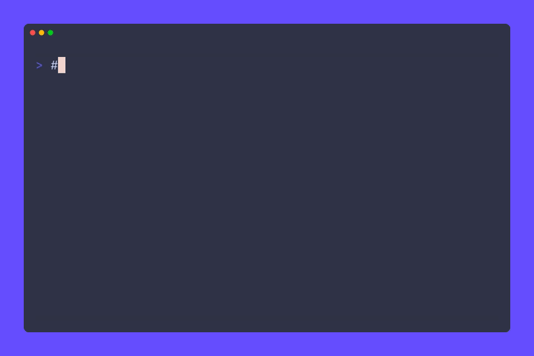

# 🐱 PurrCrypt 🐶

## Fur-ociously Secure, Paw-sitively Adorable!

The *purr*-fect way to keep your secrets *fur*-ever safe, straight from the *meow*-th of your computer to your *fur*-ends' paws!

  



> [!IMPORTANT]  
> PurrCrypt is real cryptography in a fuzzy disguise! Your messages are protected by the same elliptic curve algorithms used by Bitcoin, just wrapped in adorable cat and dog sounds. Cuteness should never compromise security!

## What's This Fuzzy Thing? 🐾

PurrCrypt is what happens when a very serious cryptographer gets distracted by cat videos for 48 hours straight! It's a super-strong encryption tool that hides your secrets in the most adorable way possible - by turning them into kitty and puppy speak!

Under the fluffy exterior, PurrCrypt uses the same elliptic curve cryptography (*meow*-thematics?) as Bitcoin. But instead of boring code, your secret messages look like they were written by a cat walking across your keyboard... ON PURPOSE! 😸

> "Finally, my keyboard stomping has been recognized as a valid form of communication!" - *Your Cat, probably*

> [!NOTE]
> While PurrCrypt messages look like nonsensical pet sounds, they contain cryptographically secure data that can only be decrypted with the proper keys. No amount of treats will convince these pets to reveal your secrets!

## How to Use This Furry Little Tool 🧶

### Installation (Getting Your Paws On It)

```bash
# Clone this ball of yarn
git clone https://github.com/vxfemboy/purrcrypt.git

# Pounce into the directory
cd purrcrypt

# Install it like you'd install a new cat tree
cargo install --path .
```

> [!TIP]
> For the best experience, try saying "meow" or "woof" out loud while your encryption runs. It doesn't affect the algorithm at all, but it does make you feel more connected to the process! 🐱

### Getting Started (Or "How To Stop Chasing Your Tail")

1. **Generate a keypair** (AKA make your secret paw print):
   ```bash
   purr genkey fluffy
   ```
   *This is like getting your pet microchipped, but for your messages!*

2. **Import your friend's key** (teaching your pet who's friendly):
   ```bash
   purr import-key --public ~/Downloads/mr_whiskers_key.pub
   ```
   *Now your computer knows which furry friends to trust!*

3. **List your keys** (checking who's in your pack/clowder):
   ```bash
   purr list-keys
   ```
   *It's like looking at your pet's contact list, if pets had phones!*

4. **Choose your pet personality**:
   ```bash
   purr set-dialect cat   # For the feline-inclined
   # or
   purr set-dialect dog   # For the canine-convinced
   ```
   *The eternal debate: are you a cat person or a dog person? Now your encryption can match your pet preference!*

> [!WARNING]  
> Just like real pets, your private keys need proper protection! Keep your private key files as secure as your cat keeps its favorite napping spot. If someone else gets your private key, they can read all your secret messages, and that's a cat-astrophe!

### Encrypting Files (Wrapping Your Secrets In Fur)

Send a secret to your furry friend:
```bash
purr encrypt --recipient mr_whiskers --input secret_catnip_stash_locations.pdf --dialect cat
```

This creates `secret_catnip_stash_locations.pdf.purr` that looks like it was written by a cat with a very specific meowing pattern!

> "This message not suspicious at all. Just normal cat talk. No secrets. Meow." - *Undercover Agent Whiskers*

> [!CAUTION]
> Even with cat/dog encoding, don't put your encryption keys on your collar tag! PurrCrypt is designed to hide the fact you're sending encrypted data, but once someone knows you're using it, they'll recognize those suspiciously well-structured "meows" and "woofs" for what they really are!

### Decrypting Files (Unwrapping The Hairball)

When your fuzzy buddy sends you a secret:
```bash
purr decrypt --key fluffy --input suspicious_dog_noises.purr --output true_meaning_of_bork.txt
```

## 📜 The Complete Guide to Pet Commands

```
purr - Because "woof" and "meow" are actually secret codes!

Usage:
    purr [COMMAND] [OPTIONS]

Commands:
    genkey [name]                   Create your pet's digital paw print
    import-key [--public] <keyfile> Add a furry friend to your trusted circle
    encrypt, -e                     Turn your boring text into pet speak
    decrypt, -d                     Translate pet speak back to human
    list-keys, -k                   See all the pets in your digital neighborhood
    set-dialect <cat|dog>           Decide if you're team 😺 or team 🐶
    verbose, -v                     Make it extra chatty (like a Siamese cat)

Options for encrypt:
    -r, --recipient <key>           Which pet friend gets the message
    -o, --output <file>             Where to leave this furry message
    -i, --input <file>              The boring human file to convert
    --dialect <cat|dog>             Temporary species switch

Options for decrypt:
    -k, --key <key>                 Your pet identity
    -o, --output <file>             Where to put the decoded human-speak
    -i, --input <file>              The furry message to translate
```

> [!TIP]
> Can't remember a command? Just think: "What would my cat/dog do?" For example, to generate a key, imagine your cat making its mark (genkey), or to encrypt a file, think of your dog hiding its favorite bone (encrypt)!

## How Does This Furry Magic Work? 🔮

### The Curious Case of Cryptographic Cats and Ciphering Canines

PurrCrypt operates on the scientific principle that everything is better with cats and dogs:

1. **Layer 1: Serious Business** 🧐
   - Hardcore mathematical encryption that would make your high school math teacher proud
   - The same elliptic curves used by Bitcoin (but much cuter)
   - So secure even the NSA would just say "awww" and leave it alone

2. **Layer 2: The Fluffy Disguise** 🦮🐈
   - Your already-secure data gets dressed up in a pet costume
   - To anyone else, it just looks like you REALLY love your pets
   - "It's not encrypted data, officer! I just really like to type 'mew purr nyaa' 800 times!"

> [!IMPORTANT]  
> While we joke about how cute this all is, PurrCrypt uses real cryptographic principles! The secp256k1 elliptic curve provides strong security, and the steganographic encoding genuinely helps hide the fact that you're sending encrypted content. Security through adorability is still security!

### The Sneaky Science of Pet-Speak Patterns

When your cat runs across your keyboard, it's annoying. When PurrCrypt does it, it's encryption!

🐱 **Cat Mode Vocabulary**:
- "mew" (for when your cat is being subtle)
- "meow" (standard cat operations)
- "purr" (contentment encryption)
- "nya" (for the anime-loving cats)
- "mrrp" (the sound of secretly plotting world domination)

🐶 **Dog Mode Dictionary**:
- "woof" (basic dog communication)
- "bark" (for when emphasis is needed)
- "arf" (the covert operations bark)
- "yip" (small dog, big secrets)
- "wrf" (the confused but supportive dog sound)

> "The humans think it's just me expressing my excitement for treats, but I'm actually transferring nuclear launch codes." - *Classified Dog Operative*

### The Bit-by-Bit Breakdown (Or: How Many "r"s Mean Nuclear Launch?)

Each letter repetition in pet speak is actually encoding your bits and bytes:

1. In **Cat Speak**, the word `mmmeeeowww` might mean:
   - `mmm` = First 2 bits are `10` (binary for decimal 2)
   - `eee` = Next 2 bits are `10` (another 2)
   - `o` = Next bit is `0`
   - `www` = Last bit is `1`
   
   So that cute cat noise just encoded the binary `101001`!

2. In **Dog Speak**, `bbbaaarrkk` translates to the same value:
   - Those aren't just excited puppies - they're quantum-resistant encryption!

> [!NOTE]
> The repetition patterns are carefully crafted! In Complex patterns, each character group encodes distinct bits, while in Special patterns (like meow), the count of each letter is precisely mapped to specific bit positions in the encrypted data.

## What Your Secret Messages Look Like (Pet Edition)

### Cat Mode (When You're Feline Secretive):
```
mew purrrr nyaaa meoww purr nyaa meeww purrr nya meww meow purrrr 
nyaa meow purr nya meow purrr nyaaa mew purr mrrp purrrr nyaa
```
*Just looks like you let your cat write your emails!*

### Dog Mode (For The Canine Conspiracies):
```
woof bark arff yipp woooof baark arfff wooof barkkk arff woooof 
barkk arff woof bark yippp wooof barkkk arfff yipp wooof barkk
```
*Now you know what dogs are REALLY barking about all night!*

> [!WARNING]  
> If you see your actual pet typing messages like these, REMAIN CALM! Either: 1) You've discovered the first typing cat/dog (congratulations!), or 2) Your pet has been recruited by a secret animal intelligence agency. Either way, treat them with extra respect and treats.

## Why PurrCrypt Is The Cat's Meow & The Dog's Bollocks

- **Fur-midable Security**: The NSA would need 9 lives to crack this
- **Paw-sible Deniability**: "That's not encryption, I just really love typing like my pet!"
- **Social Engineering**: Who would suspect adorable pet sounds of being top-secret data?
- **Identity Protection**: Are you a sophisticated spy or just another cat person? No one knows!
- **Cross-Species Compatibility**: Works for both cat and dog people (finally, peace in our time)

## For The Serious Developers (Boooring! 🙀)

If you insist on being all professional about this (why though?), here's how to use it as a library:

```rust
use purrcrypt::{AnimalCipher, CipherDialect, CipherMode, crypto};

// Create a keypair (much less fun than just typing 'genkey fluffybutt')
let keypair = KeyPair::new();

// Do serious encryption stuff with silly outputs
crypto::encrypt_file(
    "boring_document.txt",
    "much_more_interesting_meows.txt",
    &recipients_key,
    CipherDialect::Cat // or Dog if you're THAT kind of person
).unwrap();
```

> [!TIP]
> For even more fun in your code, use variable names like `top_secret_hairball`, `encryption_treats`, or `security_scratchpost`. They have absolutely no effect on functionality but make reviewing your code much more enjoyable!

## Actual Testimonials From Satisfied Users

> "meow meow meow purr meow" - **Mr. Whiskers**, Chief Security Officer at WhiskerSoft Inc.

> "BARK BARK WOOF ARF BARK" - **Buddy**, Data Protection Specialist at GoodBoy Securities

> "This encryption is so cute I almost forgot it could protect me from government surveillance!" - **Anonymous Human**

> "I can finally send my grocery list without the dogs next door knowing I'm out of treats!" - **Cat Lady #427**

> [!CAUTION]
> PurrCrypt may cause side effects including: making adorable noises while typing, increased appreciation for your pets, sudden desires to encrypt everything, and unexplained urges to meow or bark at your computer. These symptoms are harmless and may actually improve your overall quality of life.

## License

Licensed under MIT, because even cats and dogs believe in open-source software!

---

*"In a world of boring encryption, be a cat walking across a keyboard."* 🐾

**DISCLAIMER**: No actual cats or dogs were forced to type encryption keys during the making of this software. They volunteered enthusiastically for treats.
